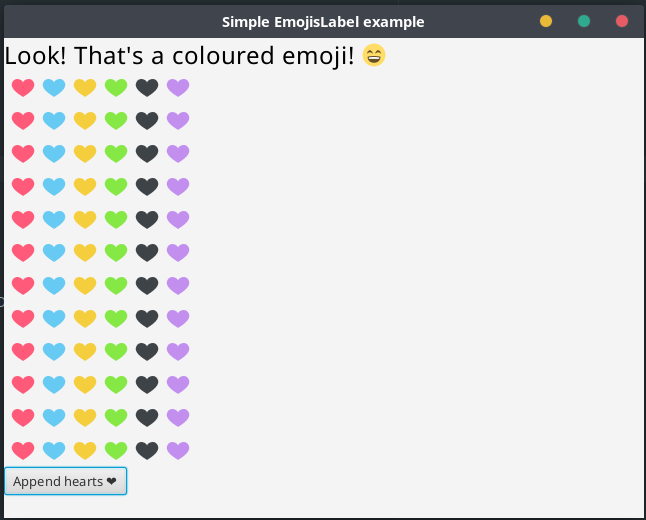

# EmojisFX

Beautiful emojis support for JavaFX 8.



Default emojis: [EmojiOne 2.2.7](https://github.com/emojione/emojione/tree/2.2.7).

## TODO

- EmojisField: editable field with emojis.
- Optimizations

## How to use

Full example: [com.madeorsk.emojisfx.examples.SimpleExample](https://github.com/Madeorsk/EmojisFX/blob/master/src/test/java/com/madeorsk/emojisfx/examples/SimpleExample.java)

### Classic label

`EmojisLabel` is very similar to a normal label, it just has one more property which is the path of the emojis directory (only internal directories for now).

```java
// See com.madeorsk.emojisfx.examples.SimpleExample in test directory for the full example.

// Create an EmojisLabel, and we are so happy that we indicate it with an emoji.
EmojisLabel label = new EmojisLabel("Look! That's a coloured emoji! \uD83D\uDE04");
label.setFont(Font.font(24)); // Please, I want to see this text!
root.getChildren().add(label);
```

### Selectable label

`EmojisLabel` text is selectable, and you can set the selection colors.

```java
// See com.madeorsk.emojisfx.examples.SimpleExample in test directory for the full example.

label.setSelectionFill(Color.BLACK); // So dark...
label.setSelectedTextFill(Color.WHITE);
```

### Linkable label

`EmojisLabel` also support integrated links!

```java
// See com.madeorsk.emojisfx.examples.SimpleExample in test directory for the full example.

EmojisLabel linkedLabel = new EmojisLabel("Do you ❤ this? If yes, consider making a donation.");
linkedLabel.setLinkTextFill(Color.rgb(255, 90, 121)); // A link with the same color as the heart.
linkedLabel.addLinkRange(new Range(24, 40, () -> { /* Link action. */ }));
root.getChildren().add(linkedLabel);
```

You can use [com.madeorsk.emojisfx.Testing](https://github.com/Madeorsk/EmojisFX/blob/master/src/test/java/com/madeorsk/emojisfx/Testing.java) as another example.
